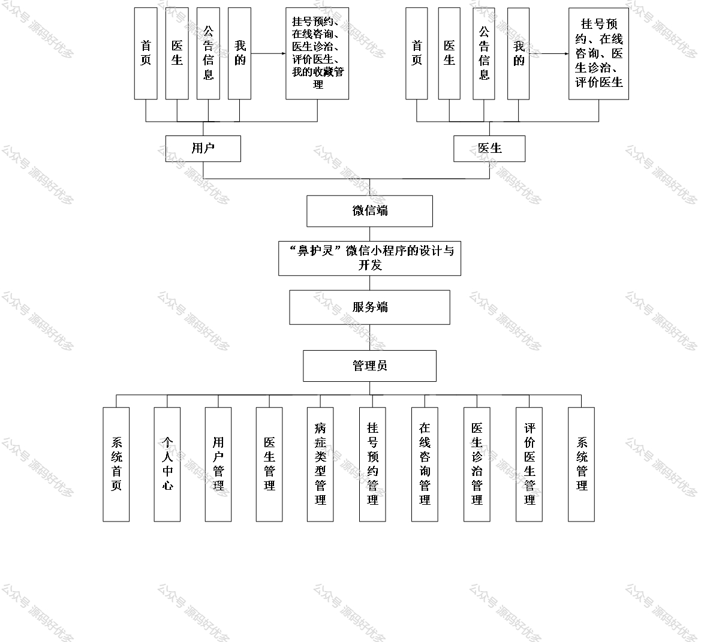
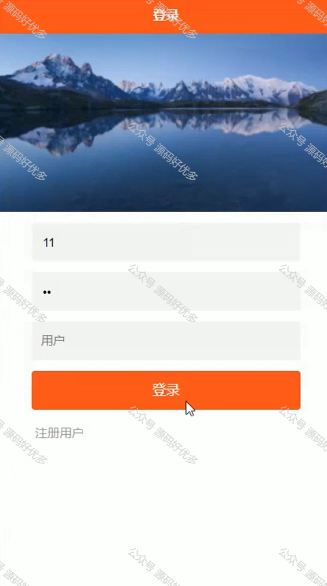
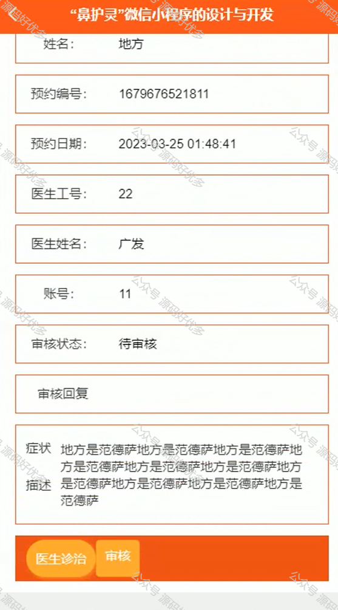
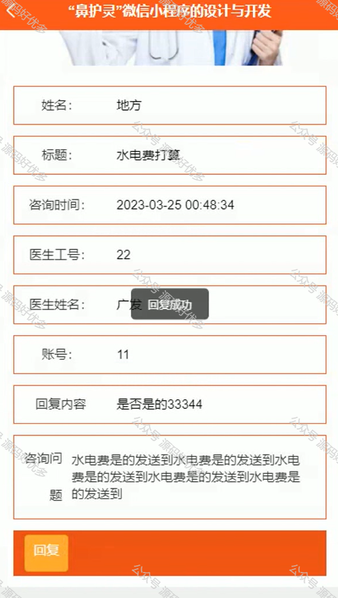
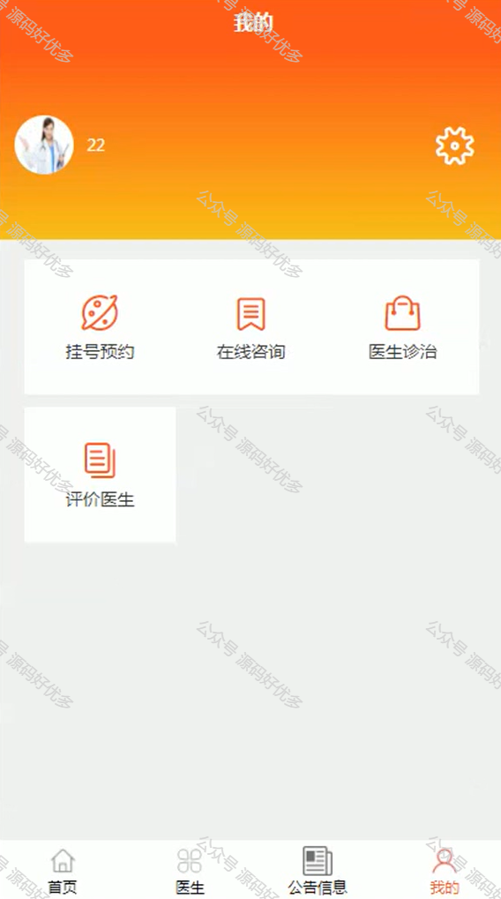
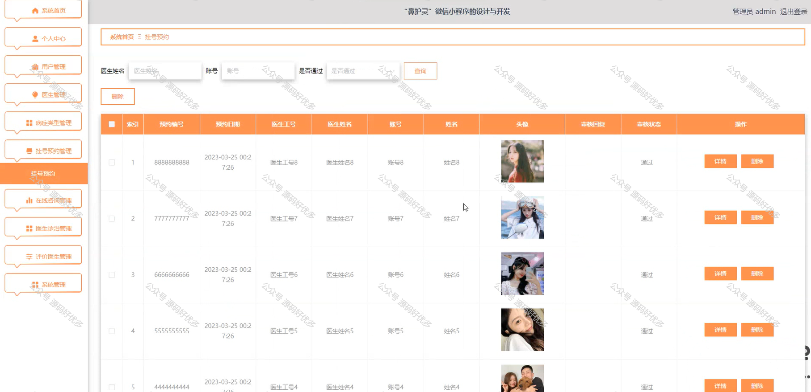
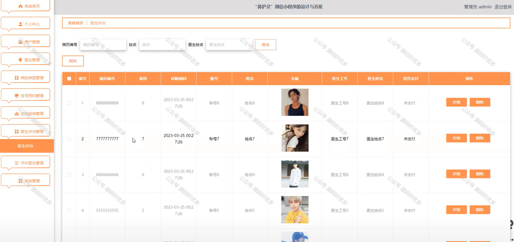
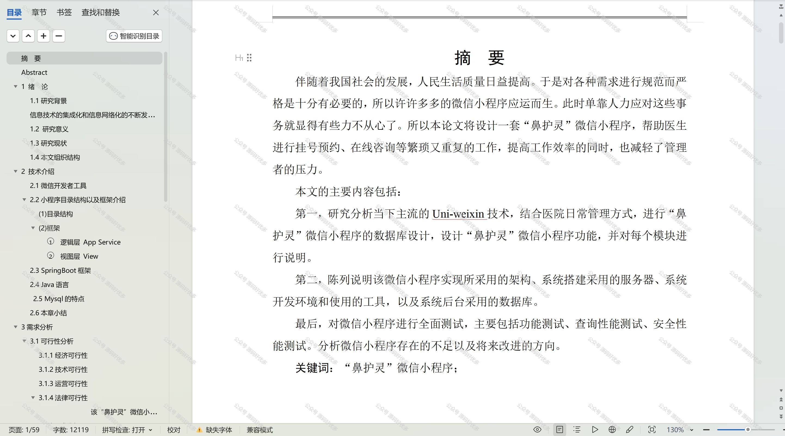

 
## 查看主页获取源码

> **作者介绍**： **✌**全网粉丝10W+本平台特邀作者、博客专家、CSDN新星计划导师、java领域优质创作者,博客之星、掘金/华为云/阿里云/InfoQ等平台优质作者、专注于项目实战 **✌**

  

### 一、作品包含

源码+数据库+设计文档万字+PPT+全套环境和工具资源+部署教程

### 二、项目技术

前端技术：Html、Css、Js、Vue、Element-ui

数据库：MySQL

后端技术：Java、Spring Boot、MyBatis

  

### 三、运行环境

开发工具：IDEA/eclipse + 微信开发者工具

数据库：MySQL5.7

数据库管理工具：Navicat10以上版本

环境配置软件： JDK1.8+Maven3.6.3

前端Nodejs：14

### 四、项目介绍
项目编号：mpweixinA005

“鼻护灵”微信小程序是一个专为医院挂号和在线咨询设计的服务平台，提供了一个方便快捷的方式，使患者能够通过微信小程序进行门诊预约和医生咨询。通过这个平台，医生可以更高效地处理挂号和咨询工作，同时减轻了管理者的压力，方便患者选择和预约。管理员可以通过后台管理系统进行用户、医生和预约信息的管理。

前台分为用户和医生
用户功能：首页、医生、公告信息、我的、在线咨询、医生诊治、评价医生、我的收藏管理。
医生功能：首页、医生、公告信息、我的、在线咨询、医生诊治、评价医生。

后台管理员的功能：系统首页、个人中心、用户管理、医生管理、病症类型管理、挂号预约管理、在线咨询管理、医生诊治管理、评价医生管理和系统管理。

### 五、运行截图

  
